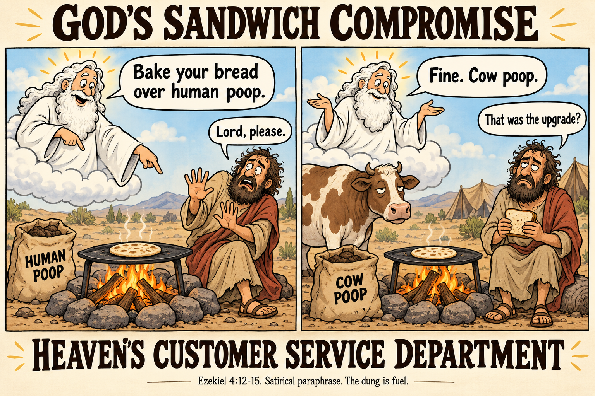

# God's sandwich compromise. Fine, use cow poop.

Imagine asking God what's for lunch and discovering that the difficult part of the conversation is going to be the fuel supply.

In Ezekiel 4, God tells his prophet to make bread and bake it using human poop. Ezekiel objects. God agrees to a substitution. Cow poop.

The creator of the universe has heard your concerns and approved a different bottom.

The passage says bread, specifically barley cakes, rather than sandwiches. The sandwich in the meme is our contribution to the menu. The dung is cooking fuel, not an ingredient. Those details matter. God's actual proposal is already strange enough without putting anything extra between the slices.

## The recipe takes a turn

[Ezekiel 4:9-11](https://www.biblegateway.com/passage/?search=Ezekiel%204%3A9-11&version=WEB) starts with a surprisingly respectable shopping list. Wheat, barley, beans, lentils, millet, and spelt go into one vessel to make bread. Food and water are rationed.

So far, you could mistake this for a grim little meal-prep channel. Then verse 12 supplies the part you would hope the cookbook editor had caught.

> "you shall bake it in their sight with dung that comes out of man."
>
> Ezekiel 4:12, World English Bible, excerpt

Human poop. In public. As directed by God.

Somewhere, a prophet who thought this job involved delivering messages is realizing that it also includes operating the world's least appealing bakery.

You can practically see the restaurant listing. Excellent view of the siege model. Limited water service. The chef has questions about the oven.

## Ezekiel asks to speak to the manager

Ezekiel does not receive the instruction with the serene smile of a man who trusts the tasting menu.

In [verse 14](https://www.biblegateway.com/passage/?search=Ezekiel%204%3A14&version=WEB), he protests that he has kept himself undefiled. He cites his history of avoiding animals that died on their own, animals torn apart, and forbidden meat. His objection concerns religious purity. Our imagined sandwich customer would also have a few questions about the smell.

The conversation has reached a remarkable stage. A human is explaining his dietary standards to the deity who is supposed to be setting them.

This is the moment for a reassuring answer. A clean oven. A pile of ordinary firewood. An admission that someone in the heavenly kitchen misread the order.

God chooses livestock.

## The heavenly upgrade is cow poop

In [Ezekiel 4:15](https://www.biblegateway.com/passage/?search=Ezekiel%204%3A15&version=WEB), God allows Ezekiel to prepare the bread using:

> "cow's dung for man's dung"
>
> Ezekiel 4:15, World English Bible, excerpt

Request approved. Your lunch now comes with the bovine fuel package.

That is the entire compromise. The poop remains. The supplier changes.

Heaven's customer service department has reviewed your complaint and determined that you qualify for a cow.

Try selling this as hospitality. The guest complains about the human-poop barbecue, and the host proudly wheels out a sack of cow manure. Everyone waits for the guest to say thank you.

Ezekiel gets a concession within the story's purity concerns. The modern reader gets an unusually specific answer to the question of how far a divine catering negotiation can go.

Apparently, as far as the barn.

## The context explains the misery

[Ezekiel 4:1-17](https://www.biblegateway.com/passage/?search=Ezekiel%204&version=WEB) describes a prophetic demonstration of Jerusalem's siege and deprivation. Ezekiel builds a siege scene, lies on his side, and measures his food and water. Verse 13 connects the unclean bread with Israel eating unclean food among the nations. Verses 16-17 return to scarcity, fear, and wasting away.

The unpleasant cooking instruction belongs to that demonstration. God directs Ezekiel to perform it. This is not a standing command for everyone to grill their lunch over human waste, and the passage does not describe a sandwich shop.

The explanation gives the scene a purpose. It also leaves the human-poop request and the cow-poop concession right there in the text.

If your prophecy requires a meeting about which species supplied the oven fuel, you have certainly made the lesson memorable. Whether anyone still wants lunch is another matter.

## Blessed are the negotiators

Ezekiel deserves credit for objecting. Faced with an appalling first offer, he gets God to revise the menu's operating conditions.

It is a small victory. The bread still comes from the poop-powered kitchen. But the next time someone tells you never to question divine instructions, remember the prophet who did and secured a cow.

The Lord works in mysterious ways. In this case, the mystery is why firewood never made the shortlist.
