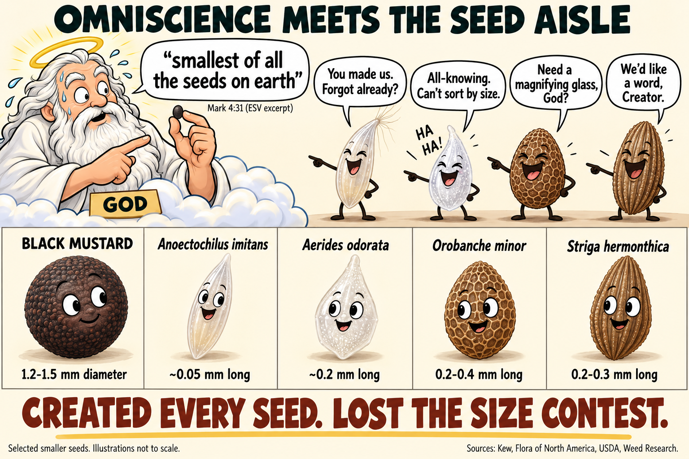

# The Bible gets mustard seeds wrong. Orchids have the receipts.

Mustard seeds are small. They are not the smallest seeds on Earth. The difference is awkward for a book whose every factual claim is sometimes defended as the word of an all-knowing God.

In the mustard-seed parable, Matthew and Mark attribute a sweeping seed-size comparison to Jesus. Read as a universal botanical statement, that comparison is wrong. You can preserve the parable's religious lesson. You cannot make the smaller seeds disappear.

## What the Bible actually says

Matthew introduces the story as a parable about the kingdom of heaven. A man plants a mustard seed, and the plant grows large enough for birds to lodge in its branches. The seed is described as:

> "Which indeed is the least of all seeds"
>
> Matthew 13:32, King James Version, excerpt

Mark gives the comparison an especially broad wording:

> "is less than all the seeds that be in the earth"
>
> Mark 4:31, King James Version, excerpt

These are words attributed to Jesus in a story about God's kingdom. The ESV renders Mark 4:31 as "smallest of all the seeds on earth," the exact excerpt used in the meme. The cartoon depicts God as the supposed omniscient creator for comic effect. [Mark 4:31, ESV](https://www.esv.org/verses/Mark%2B4%3A31/).

Read the passages in context at [Matthew 13:31-32](https://www.biblegateway.com/passage/?search=Matthew%2013%3A31-32&version=KJV) and [Mark 4:30-32](https://www.biblegateway.com/passage/?search=Mark%204%3A30-32&version=KJV).

## The smaller seeds turn up anyway

Black mustard, Brassica nigra, provides a concrete comparison. Flora of North America gives its seeds a typical diameter of 1.2 to 1.5 millimetres, with some reaching 2 millimetres. The Gospel passages do not specify a modern species. This comparison therefore uses black mustard as an identified example, not as a proven identification of the ancient plant. [Flora of North America](https://efloras.org/florataxon.aspx?flora_id=1&taxon_id=200009265).

Here are four smaller examples:

- **Anoectochilus imitans, a jewel orchid.** Kew reports a seed length of about 0.05 millimetres from the botanical literature. That is roughly one twenty-fourth of a 1.2-millimetre mustard seed's diameter. Kew presents the measurement as a literature report, not a new measurement of its own. [Kew's orchid-seed account](https://www.kew.org/read-and-watch/orchid-seeds-natures-tiny-treasures).
- **Aerides odorata, an orchid.** Kew's seed morphologist Wolfgang Stuppy describes seeds around 0.2 millimetres long that he encountered at the Millennium Seed Bank. [Kew's orchid-seed account](https://www.kew.org/read-and-watch/orchid-seeds-natures-tiny-treasures).
- **Orobanche minor, small broomrape.** The USDA identification resource lists seed lengths of 0.2 to 0.4 millimetres. This parasitic flowering plant supplies a counterexample outside the orchid family. [USDA SeedImages](https://idtools.org/seedimages/index.cfm?entityID=62727&packageID=2289).
- **Striga hermonthica, purple witchweed.** A study of this species' seedbank describes Striga seeds as 0.2 to 0.3 millimetres in size. [Mitiku and colleagues, Weed Research](https://pmc.ncbi.nlm.nih.gov/articles/PMC9322021/).

These figures compare reported linear dimensions. They are not a claim that length, diameter, mass, and volume are interchangeable. The meme enlarges the tiny seeds so you can see them and explicitly labels its illustrations as not to scale.

This is a selection, not a complete inventory of every species with seeds smaller than mustard. There is no need to pretend otherwise. One real counterexample defeats a universal claim.

## Does "it's a parable" solve the problem?

The strongest defense starts with the story's purpose. Jesus is describing dramatic growth from a tiny beginning. A listener can understand that image without treating the seed comparison as a global scientific ranking. The references to sowing, fields, and garden plants support an interpretation limited to familiar agricultural experience.

That is a reasonable way to read a parable. It also changes what the sentence is allowed to claim. Under that interpretation, "all seeds" is ordinary exaggeration or a comparison within an implied local set. It is not a precise statement about every seed on Earth.

The passages themselves do not provide a list of crops that defines this smaller comparison set. Saying "the smallest seed those particular farmers commonly sowed" supplies context to defend the wording. It does not establish that mustard holds a worldwide botanical record.

So there are two different questions. Is the universal botanical claim true? No. Does its failure prove that the parable's spiritual lesson is false, or that God does not exist? No. The criticism lands on a literal scientific reading and on versions of biblical inerrancy that insist this wording must be factually exact.

An ordinary storyteller can use an imprecise comparison. An omniscient creator presented as delivering flawless botany faces a harder question. Why does the seed catalog need an asterisk?

## God forgot to check the inventory

The joke is an embarrassed creator meeting four seeds smaller than his supposed champion. They laugh at his claim and ask whether he forgot his own creations. God's speech bubble quotes Mark 4:31 in the ESV. The seed names and measurements come from the sources above.

The mustard seed can keep its role in the parable. It loses the smallest-seed trophy.
